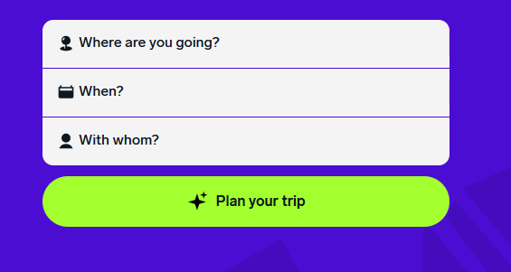

# Bihar Travel Planner

## Overview
An interactive web application designed to help tourists and travelers plan their trips to Bihar's villages and tourist destinations through an intuitive drag-and-drop interface.

## Requirements
A web application to help users plan trips to Bihar villages and tourist spots with drag-and-drop itineraries.

## Core Features
1. Drag-and-Drop Itinerary Planner
   - Create customizable day-wise itineraries
   - Reorder activities and destinations
   - Save and edit trip plans

2. Local Attraction Suggestions
   - Curated list of tourist spots
   - Cultural heritage sites
   - Local villages and experiences
   - Seasonal festivals and events

3. Interactive Map Integration
   - Visual representation of destinations
   - Route visualization
   - Distance and travel time estimates
   - Points of interest markers

4. Search Functionality
   - Search by destination name
   - Filter by categories (temples, villages, museums, etc.)
   - Sort by popularity/distance

5. Responsive Design
   - Mobile-first approach
   - Cross-browser compatibility
   - Accessible interface

## Technical Requirements
- Frontend: HTML5, CSS3, JavaScript
- Map Integration: Google Maps/Leaflet
- Responsive Framework: Bootstrap/Tailwind
- Drag-and-Drop: HTML5 Drag & Drop API

## Development Phases

### Phase 1: Core Features Implementation
1. Basic Structure Setup
   - HTML layout with Bootstrap
   - Responsive design implementation
   - Basic CSS styling

2. Attraction Management
   - Display attractions list
   - Image handling with placeholders
   - Rating system implementation
   - Category filtering

3. Drag and Drop Implementation
   - Basic drag and drop functionality
   - Visual feedback during drag
   - Drop zone handling
   - Reordering capability

4. Search and Filter
   - Search by name
   - Category filtering
   - Location-based filtering
   - Sort by popularity

### Phase 2: Enhanced Features
1. Map Integration
   - Google Maps setup
   - Marker placement
   - Route visualization
   - Distance calculation

2. User Experience
   - Loading states
   - Error handling
   - Smooth animations
   - Touch device support

3. Data Management
   - Local storage implementation
   - Itinerary saving
   - Export functionality
   - Data persistence

### Phase 3: Future Enhancements
1. Backend Integration
   - User authentication
   - Cloud storage
   - Real-time updates
   - API implementation

2. Social Features
   - Share itineraries
   - User reviews
   - Rating system
   - Social media integration

## Testing Requirements
1. Unit Testing
   - Component functionality
   - Data handling
   - User interactions
   - Error scenarios

2. Integration Testing
   - Cross-browser compatibility
   - Responsive design
   - Performance testing
   - Load testing

3. User Testing
   - Usability testing
   - Mobile testing
   - Accessibility testing
   - Beta testing

## Documentation Requirements
1. Technical Documentation
   - Code documentation
   - API documentation
   - Setup guides
   - Deployment instructions

2. User Documentation
   - User guides
   - FAQs
   - Tutorial videos
   - Help documentation

## Maintenance Plan
1. Regular Updates
   - Security patches
   - Feature updates
   - Bug fixes
   - Performance optimization

2. Monitoring
   - Usage analytics
   - Error tracking
   - Performance monitoring
   - User feedback

## Target Audience
- Tourists visiting Bihar for cultural and historical exploration
- Local travelers interested in discovering lesser-known villages
- Travel enthusiasts who prefer customizable itineraries
- Travel agencies promoting tourism in Bihar

## Success Metrics
1. User Engagement
   - Number of created itineraries
   - Time spent on platform
   - Return visits
   - Feature usage statistics

2. Performance Metrics
   - Page load times
   - Response times
   - Error rates
   - Mobile usability scores

3. Business Goals
   - Increased tourism awareness
   - User satisfaction ratings
   - Platform adoption rate
   - Feature completion rate

#attractions-list {
    max-height: 500px;
    overflow-y: auto;
}

.list-group-item {
    border: 1px solid #e0e0e0;
    margin-bottom: 0.5rem;
    border-radius: var(--border-radius);
    cursor: pointer;
    transition: all 0.3s ease;
}

.list-group-item:hover {
    background-color: #f8f9fa;
    transform: translateY(-2px);
    box-shadow: 0 2px 4px rgba(0, 0, 0, 0.05);
}
const attractions = [
    {
        id: 1,
        name: "Mahabodhi Temple",
        category: "temples",
        location: "Bodh Gaya",
        description: "UNESCO World Heritage Site, sacred Buddhist temple",
        image: "assets/images/mahabodhi-temple.jpg",
        popularity: 5,
        coordinates: { lat: 24.6959, lng: 84.9911 }
        function createAttractionElement(attraction) {
    const element = document.createElement('div');
    element.className = 'list-group-item draggable';
    element.draggable = true;
    element.dataset.id = attraction.id;
    element.innerHTML = 
        

            

                
            

            

                <h5 class="mb-1">${attraction.name}</h5>
                
${attraction.description}

                

                    <small class="location"><i class="fas fa-map-marker-alt"></i> ${attraction.location}</small>
                    <small class="category">${attraction.category}</small>
                    

                        ${'★'.repeat(attraction.popularity)}${'☆'.repeat(5-attraction.popularity)}
                    

// Expanded attraction data based on Bihar's tourist spots
 i  want to position the rating under the image and ensure there’s no unnecessary spacing.
 Fix Rating Positioning Under the Image
 #Make the User Interface More Interactive
 ##hower affect the rating and image position
 #Make the Map Section Engaging
 ##add some animation and make it more interactive
 ##Your Itinerary
 ##add some animation and make it more interactive

  #Implement the drag-and-drop functionality for the itinerary.
###Save and retrieve the itinerary using localStorage for persistence.
###Add options to edit or delete items from the itinerary.
###Integrate Google Maps API to show travel routes and estimated times between locations.
###Provide mobile responsiveness and clean design for a better user experience.

## New Implementation Requirements

### 1. Fix Rating Positioning Under the Image
- Ensure ratings appear directly under attraction images
- Maintain consistent spacing and alignment
- Make ratings visually appealing and clear
- Add hover effects for better user interaction

### 2. Make the User Interface More Interactive
- Add hover effects for attraction cards
- Implement smooth transitions and animations
- Enhance visual feedback for user actions
- Improve drag-and-drop visual cues

### 3. Make the Map Section Engaging
- Add animations for marker placement
- Implement smooth route visualization
- Add interactive info windows
- Include zoom and pan animations
- Highlight selected locations

### 4. Enhance Your Itinerary Section
- Add animations for adding/removing items
- Implement smooth reordering transitions
- Include visual feedback for actions
- Add drag-and-drop indicators
- Improve mobile touch interactions

### 5. Core Functionality Implementation
1. Drag-and-Drop Itinerary
   - Implement intuitive drag-and-drop functionality
   - Add visual feedback during dragging
   - Enable touch device support
   - Allow reordering of items

2. Local Storage Integration
   - Save itineraries to localStorage
   - Implement auto-save functionality
   - Add restore capability
   - Handle storage limits

3. Itinerary Management
   - Add edit functionality for items
   - Implement delete with confirmation
   - Enable bulk actions
   - Add undo/redo capability

4. Google Maps Integration
   - Show travel routes between locations
   - Display estimated travel times
   - Add traffic information
   - Enable alternative route suggestions

### 6. Mobile Responsiveness
1. Design Requirements
   - Implement mobile-first approach
   - Ensure touch-friendly interfaces
   - Optimize for different screen sizes
   - Maintain functionality across devices

2. User Experience
   - Smooth animations on mobile
   - Touch-friendly controls
   - Responsive images
   - Optimized performance

### 7. Testing Requirements
1. Functionality Testing
   - Test drag-and-drop on all devices
   - Verify localStorage functionality
   - Check map integration
   - Test route calculations

2. Compatibility Testing
   - Cross-browser testing
   - Mobile device testing
   - Performance testing
   - Storage limit testing

## Your Itinerary Section Requirements

### 1. Core Itinerary Features
1. Basic Functionality
   - Add attractions to itinerary via drag and drop
   - Remove items from itinerary
   - Reorder items using up/down buttons
   - Clear entire itinerary option
   - Save itinerary functionality

2. Visual Elements
   - Thumbnail images of attractions
   - Location information
   - Attraction descriptions
   - Popularity ratings
   - Distance between locations
   - Estimated travel times

3. Interactive Features
   - Smooth drag and drop animations
   - Visual feedback during dragging
   - Hover effects on items
   - Confirmation for deletions
   - Reordering animations

### 2. Itinerary Management
1. Organization Features
   - Day-wise planning capability
   - Time slot allocation
   - Duration estimates
   - Break suggestions
   - Route optimization

2. Data Management
   - Local storage saving
   - Export to PDF/Print option
   - Share itinerary feature
   - Backup functionality
   - Restore previous itineraries

3. User Controls
   - Edit item details
   - Add personal notes
   - Set visit duration
   - Mark favorites
   - Priority setting

### 3. Route Planning
1. Map Integration
   - Show route between attractions
   - Display total distance
   - Estimated travel times
   - Alternative route suggestions
   - Traffic information

2. Transportation Options
   - Mode of transport selection
   - Public transport information
   - Taxi/auto fare estimates
   - Walking routes where applicable
   - Parking information

### 4. Mobile Experience
1. Touch Interactions
   - Touch-friendly drag and drop
   - Swipe to delete
   - Pinch to zoom map
   - Long press for options
   - Smooth scrolling

2. Responsive Design
   - Adaptive layout for small screens
   - Collapsible sections
   - Touch-friendly buttons
   - Readable text size
   - Optimized images

### 5. Additional Features
1. Smart Suggestions
   - Nearby attractions
   - Popular combinations
   - Time-based recommendations
   - Weather considerations
   - Seasonal attractions

2. Social Features
   - Share on social media
   - User reviews integration
   - Rating system
   - Comment section
   - Like/save options

### 6. Accessibility Features
1. User Interface
   - High contrast mode
   - Screen reader compatibility
   - Keyboard navigation
   - Font size adjustments
   - Color blind friendly

2. Help & Support
   - Tutorial overlay
   - Tool tips
   - Help documentation
   - Error handling
   - User feedback system

### 7. Performance Requirements
1. Response Times
   - Instant drag and drop feedback
   - Quick reordering
   - Smooth animations
   - Fast map updates
   - Efficient data saving

2. Reliability
   - Offline functionality
   - Auto-save feature
   - Error recovery
   - Data backup
   - Browser compatibility

## Your Custom Requirements

### 1. Rating System Enhancement
1. Visual Positioning
   - Position ratings directly under attraction images
   - Remove unnecessary spacing between image and rating
   - Ensure consistent alignment across all cards
   - Add hover effects for ratings

2. Interactive Rating Display
   - Animated star filling on hover
   - Clear visual distinction between filled and unfilled stars
   - Smooth color transitions
   - Responsive sizing for different screens

### 2. Enhanced User Interface Interactions
1. Hover Effects
   - Smooth scaling for attraction cards
   - Subtle shadow animations
   - Color transitions for interactive elements
   - Feedback animations for user actions

2. Animation Improvements
   - Smooth transitions for all interactions
   - Loading animations for images
   - Card flip effects for additional information
   - Drag and drop visual feedback

### 3. Map Section Enhancements
1. Interactive Features
   - Animated marker placement
   - Smooth route visualization
   - Interactive info windows with attraction details
   - Dynamic zoom and pan animations

2. Visual Improvements
   - Custom map markers with attraction images
   - Route highlighting effects
   - Location selection animations
   - Distance visualization

### 4. Itinerary Section Updates
1. Core Functionality
   - Drag and drop between days
   - Reorder items within days
   - Add/remove items with animations
   - Save/load itineraries locally

2. Visual Enhancements
   - Day-wise separation with clear visual hierarchy
   - Timeline view of attractions
   - Distance and time indicators between locations
   - Weather integration for each day

3. Interactive Features
   - Swipe actions for mobile
   - Quick edit options
   - Drag handle animations
   - Confirmation dialogs with animations

### 5. Local Storage Implementation
1. Data Management
   - Auto-save functionality
   - Backup and restore options
   - Clear data functionality
   - Storage limit handling

2. User Preferences
   - Save view preferences
   - Remember last session
   - Custom sorting preferences
   - Filter settings persistence

### 6. Mobile-First Enhancements
1. Touch Interactions
   - Touch-friendly drag and drop
   - Swipe gestures for actions
   - Pinch to zoom on maps
   - Long press menus

2. Responsive Optimizations
   - Fluid layouts for all screen sizes
   - Optimized images for mobile
   - Touch-friendly button sizes
   - Collapsible sections for better navigation

### 7. Performance Optimizations
1. Loading Improvements
   - Progressive image loading
   - Lazy loading for off-screen content
   - Optimized animations
   - Reduced initial load time

2. Interaction Optimization
   - Smooth scrolling
   - Debounced search
   - Optimized drag and drop
   - Efficient DOM updates
  #i want make like this not just search 